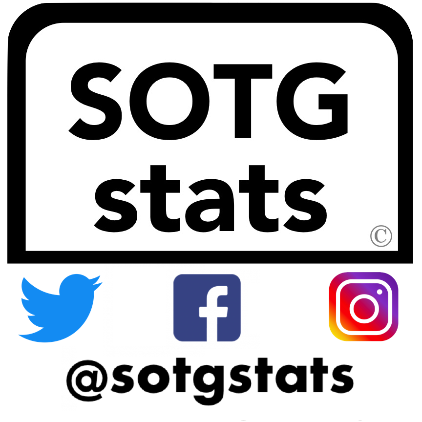

# UltiAnalytics Pull 

Use *UltiAnalytics Pull* to grab, clean, and enhance ultimate frisbee data from UltiAnalytics. Run it over *your* team's data or use it to analyze the full available data sets of professional ultimate (both AUDL and PUL). It will produce tabulated player stats with the actual player names, so you can compare stats like goals, assists, blocks, and over 20 others! Create your own metrics or graphics based to measure player or team performance per year, per game, per point, and even per quarter or per possession. To enrich your insights, this project includes supplemental data like information on the professional franchises,  game results, and now weekly active rosters (as of 2019).

## Features

- Formatted for use with super fast and awesome Python Pandas!
- Auto-matched player names for over 4,000 usernames!
- Fixes to data entry errors!
- Standardized team names!
- Extra columns to distinguish years, games, quarters, points, and even possessions!
- Individual player stats!
- Info and logos for every AUDL/PUL team ever!
- All Game Scores Ever Played!
- Grab Current Rosters!
- Weekly Active Rosters (as of 2019)!
- Playoff/Regular season ***coming soon***
- Merged Game Stats ***coming soon***

## Usage

```bash
python ultianalyticspull.py --league PUL
python ultianalyticspull.py --league AUDL
python ultianalyticspull.py --team_name'USA U24 Mixed' --year 2019 --team_number 6502443586158592
```

then

```bash
python individualstats.py
```

That's it!

## Requirements
- Python >= 3.0
- Internet connection ;)
- Python libraries: glob,urllib,argparse,pandas,numpy,csv (pretty standard stuff)

## Citations

Doing something cool with *UltiAnalytics Pull*? Let me know!

Here's a list of work UltiAnalytics Pull has launched so far:

- Articles in Ultiworld
  - [Predicting Breakout Stars of 2019](https://ultiworld.com/2019/03/29/predicting-audls-breakout-stars-stats/)
  - [Accessing MVP Candidates of 2018](https://ultiworld.com/2017/10/03/assessing-audl-mvp-candidates/)
- SOTG Stats - [Twitter](https://twitter.com/sotgstats), [Instagram](https://instagram.com/sotgstats/), [Facebook](https://www.facebook.com/sotgstats/)
  - Advancing Analytics in Ultimate. See, for example:
    - Net Stats - https://twitter.com/sotgstats/status/1111381496789504002
    - Handler Number - https://twitter.com/sotgstats/status/885529847623274496
    - Individual Efficiency Boost - https://twitter.com/sotgstats/status/870357352725315584
    - Individual Efficiency Decrease/Drain - https://twitter.com/sotgstats/status/871448880323473410
    - Possession Conversion - https://twitter.com/sotgstats/status/870008776748695554
  - Performing Predicative Analysis
    - https://twitter.com/sotgstats/status/935987429747675141
    - https://twitter.com/sotgstats/status/900458814528528384
    - https://twitter.com/sotgstats/status/1013669331874516992
 - Novel Visualizations
   - https://twitter.com/sotgstats/status/1116326922500345856
   - https://twitter.com/sotgstats/status/1115600848694829057
   - https://twitter.com/sotgstats/status/962909472590041096
   - https://twitter.com/sotgstats/status/919763130561024000
   - https://twitter.com/sotgstats/status/918887852024500225
   - https://twitter.com/sotgstats/status/910299788922511361
   - https://twitter.com/sotgstats/status/895377402255355904
   - https://twitter.com/sotgstats/status/885894880874172418
   - https://twitter.com/sotgstats/status/1000192420460531712
   - https://twitter.com/sotgstats/status/1089294636089294848
- Other Works
  - AUDL Stats App under development
  - [Overlooked Stars of 2018](https://afbcary.github.io/audl-stats/)
